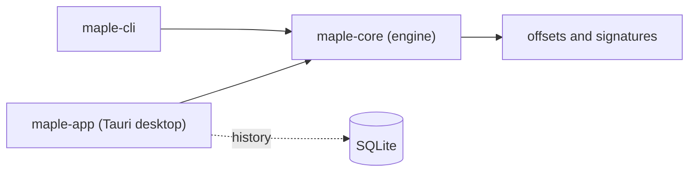

# TajuC

Malware analyst and computer science student. I work low in the stack: reverse engineering Windows binaries, PE analysis, and the tooling that turns that work into something repeatable. I build pattern and signature scanners, memory-inspection utilities, and the CLI and desktop apps around them, in Rust and C++.

Most of my public work is game-client binary analysis: reading a target's memory, finding byte signatures and offsets that hold across client builds, and making that reproducible. MapleStory is the case study; the flagship project carries the approach across three surfaces on one engine.

**Responsible use.** Everything here is built for reverse-engineering practice, binary analysis, and authorized research on software I own or am permitted to study.

  
  

---

## Featured work

### [MapleDumper-rs](https://github.com/TajuC/MapleDumper-rs)

A cross-version signature and offset toolkit for MapleStory clients, built on one Rust engine. It ships an AVX2-accelerated masked scanner, a relocation-aware Signature Maker that mints patterns surviving client patches, a desktop workspace, and a CLI.

The same `maple-core` library feeds three surfaces:

- **`maple-core`** - the engine that does the scanning, signature, and analysis work, written so the fast path is the masked path.
- **`mapledumper.exe`** - a scriptable CLI with `scan`, `lint`, `diff`, `asm`, `mksig`, `profile`, and `unpack` subcommands, JSON output, and stable exit codes for scripting and CI.
- **`maple-app`** - a frameless Tauri desktop workspace with live scanning, the Signature Maker, an assembly scanner, a Monaco-based pattern editor, local SQLite history, and an Investigate inspector.

Releases ship SBOMs and SHA256SUMS. GPL-3.0, latest release `v0.7.2`.

### [MapleDumper](https://github.com/TajuC/MapleDumper)

The C++ predecessor the Rust toolkit grew out of. A SIMD and AVX2 optimized pattern scanner, and where the performance approach behind the current engine started.

### [SafeMemoryAccess](https://github.com/TajuC/SafeMemoryAccess)

A header-only C++ utility for safe, structured memory access. Aimed at internal game projects, but flexible enough for any low-level Windows work.

---

## More public work

- [MapleC](https://github.com/TajuC/MapleC) - C++. An internal menu for a MapleStory client (GMS 253.3) that shows live player stats.
- [MapleAOB](https://github.com/TajuC/MapleAOB) - C++. A simple array-of-bytes scanner.
- [clalit-pharmacy-stock-scanner](https://github.com/TajuC/clalit-pharmacy-stock-scanner) - JavaScript. An automated pharmacy stock scanner with a bilingual English and Hebrew dashboard.
- [Templates-Utility](https://github.com/TajuC/Templates-Utility) - C++. Fast access to repeated message templates for customer-service and technical-support staff.
- [study-reminder-service](https://github.com/TajuC/study-reminder-service) - Python. Discord webhook reminders for a weekly class schedule.
- [StringFinder](https://github.com/TajuC/StringFinder) - Python.

---

## What I work in

**Reverse engineering and low-level Windows** - AOB and byte-signature scanning, offset and pattern research, PE and portable-executable internals, safe memory access, internal game research tooling.

**Performance** - SIMD and AVX2 accelerated scanning on x86 and x64.

**Systems** - Rust and C++ for the core, with practical Python and JavaScript tooling around it. Tauri for desktop, SQLite for local state, NSIS for installers. Releases ship SBOM and SHA256 artifacts.

Based in Israel. I work in English and Hebrew. Open to early-career work in reverse engineering, malware analysis, low-level Windows security, security tooling, and game security research.
